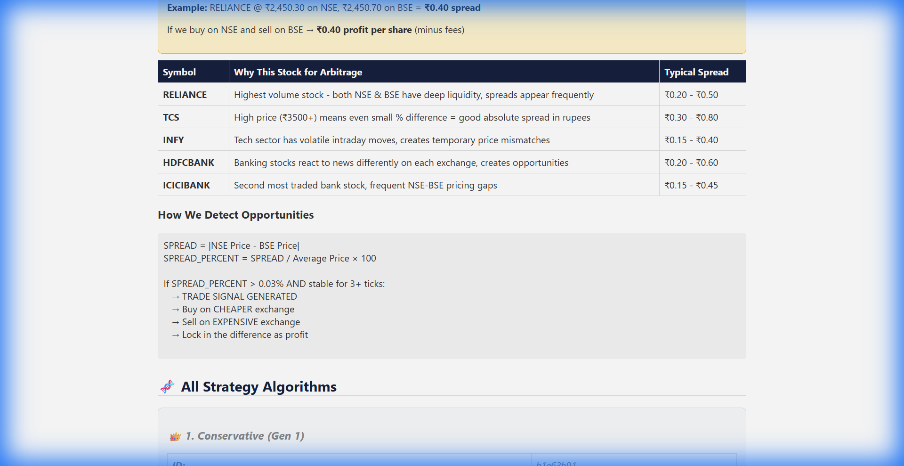

# 🧬 Quant Strategy Research Engine

<div align="center">


**A self-improving quantitative trading research engine that exploits NSE-BSE price differences**

[Features](#-features) • [How It Works](#-how-it-works) • [Installation](#-installation) • [Screenshots](#-screenshots) • [Strategy](#-strategy)

</div>

---

## 🎯 What Is This?

This is an **NSE-BSE Arbitrage Research Engine** that:

1. **Monitors** real-time price differences between NSE and BSE for the same stock
2. **Detects** when the spread exceeds a profitable threshold (typically ₹0.30-0.80)
3. **Simulates** buying on the cheaper exchange and selling on the expensive one
4. **Evolves** strategies using genetic algorithms - bad strategies die, good ones survive

> ⚠️ **Educational Only** - This runs in paper trading mode. No real money is traded.

---

## 📊 The Arbitrage Opportunity

```
NSE Price: ₹2,450.30  |  BSE Price: ₹2,450.70
                         ↓
              Spread = ₹0.40 per share
                         ↓
        Buy 100 shares on NSE = ₹2,45,030
        Sell 100 shares on BSE = ₹2,45,070
                         ↓
              Profit = ₹40 (minus fees)
```

This happens multiple times per day across high-liquidity stocks!

---

## ✨ Features

| Feature | Description |
|---------|-------------|
| 🔄 **Real-time Monitoring** | WebSocket connection for live NSE-BSE prices |
| 🧬 **8 Parallel Strategies** | Different parameters compete simultaneously |
| 📈 **Self-Evolution** | Bottom 25% strategies retire, top ones reproduce |
| 🏆 **Champion-Challenger** | Best strategy handles the "real" portfolio |
| 🛡️ **Risk Management** | Daily loss caps, position limits, kill switch |
| 📊 **Live Dashboard** | Web UI showing all metrics in real-time |
| 📄 **Printable Reports** | Complete trade log and strategy analysis |

---

## 🖥️ Screenshots

### Dashboard

*Real-time dashboard showing portfolio, strategies, and controls*

### Report Page

*Complete report with all strategy DNA and trade history*

---

## 🚀 Installation

```bash
# Clone the repo
git clone https://github.com/SypherKx/Quant-Strategy-Research-Engine.git
cd Quant-Strategy-Research-Engine

# Install dependencies
pip install -r requirements.txt

# Run the engine
python run.py
```

Open **http://localhost:8000** in your browser!

---

## 🧠 How It Works

### 1. Strategy DNA
Each strategy has genetic parameters:
```python
{
    "min_spread_threshold": 0.03,  # Minimum % spread to trade
    "stability_ticks": 3,          # How long spread must be stable
    "position_size_pct": 5.0,      # % of capital per trade
    "take_profit_pct": 0.05,       # Exit at this profit %
    "stop_loss_pct": 0.02,         # Exit at this loss %
}
```

### 2. Evolution Process
```
Generation 1: 8 random strategies compete
        ↓
After 24 hours: Evaluate performance (Sharpe, Win Rate, Drawdown)
        ↓
Bottom 25% (2 strategies) → RETIRED ☠️
Top performers → Create mutated offspring
        ↓
Generation 2: New population competes
        ↓
Repeat... strategies get better over time!
```

### 3. Performance Metrics
- **Sharpe Ratio**: Risk-adjusted returns
- **Win Rate**: Percentage of profitable trades
- **Max Drawdown**: Worst peak-to-trough loss
- **Composite Score**: Weighted combination for ranking

---

## 📁 Project Structure

```
├── run.py                 # Entry point
├── config.py              # Settings (capital, risk limits)
├── core/
│   ├── database.py        # SQLite async storage
│   ├── logger.py          # Colored logging
│   └── scheduler.py       # Market hours scheduler
├── data/
│   ├── upstox_auth.py     # OAuth2 + TOTP
│   ├── websocket_streamer.py  # Real-time data
│   └── instruments.py     # NSE/BSE symbol mapping
├── analysis/
│   ├── regime_analyzer.py # Volatility/Liquidity detection
│   └── spread_analyzer.py # NSE-BSE spread calculation
├── strategies/
│   ├── strategy_dna.py    # Genetic parameters
│   ├── generator.py       # Population creation
│   ├── simulator.py       # Parallel execution
│   └── paper_trader.py    # Champion-Challenger
├── evolution/
│   └── evaluator.py       # Sharpe, Sortino, Drawdown
├── risk/
│   └── risk_manager.py    # Kill switch, limits
└── api/
    └── main.py            # FastAPI + Dashboard
```

---

## ⚙️ Configuration

Copy `.env.example` to `.env`:

```env
# Optional: Upstox API for live data
UPSTOX_API_KEY=your_key
UPSTOX_API_SECRET=your_secret

# Trading settings
SYMBOLS=RELIANCE,TCS,INFY,HDFCBANK,ICICIBANK
INITIAL_CAPITAL=10000
MAX_DAILY_LOSS_PERCENT=2.0
MAX_TRADES_PER_DAY=50
```

Without API keys, the engine runs in **mock mode** with simulated data.

---

## 🔒 Risk Management

| Parameter | Default | Purpose |
|-----------|---------|---------|
| Daily Loss Cap | 2% | Stop trading after 2% daily loss |
| Max Trades/Day | 50 | Prevent overtrading |
| Max Position | 10% | No single trade > 10% of capital |
| Kill Switch | Auto | Emergency stop on extreme volatility |

---

## 📄 License

MIT License - Use freely for learning and research.

---

## ⚠️ Disclaimer

This project is for **educational and research purposes only**. 
- No real money is traded
- Past performance doesn't guarantee future results
- Real arbitrage requires sub-millisecond execution
- Actual trading involves fees, slippage, and execution risk

---

<div align="center">

**Built for learning - every decision explained, every trade documented.**

⭐ Star this repo if you find it useful!

</div>
